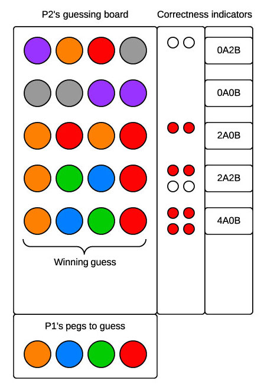

# Mastermind

## Summary
Build a command-line version of the classic puzzle game [Mastermind](https://en.wikipedia.org/wiki/Mastermind_(board_game)) (otherwise known as [Bulls and Cows](https://en.wikipedia.org/wiki/Bulls_and_cows)).

### Gameplay
One player, the code maker, selects four colored pegs and creates a code (e.g., teal, blue, gray, and white; see Figure 1).  The pegs come in six colors and colors can be repeated.  Once the code is created, the codebreaker tries to guess the code:  the correct colors in the correct sequence.

The codebreaker has 12 chances to correctly guess the code.  After each incorrect guess, the code maker provides two pieces of information to the codebreaker:  (1) the number of pegs of the right color in the right position and (2) the number of pegs of the right color but in the wrong position.

The codebreaker wins if the code is correctly guessed within 12 guesses.  The code maker wins if the codebreaker does not correctly guess the code.

### Code Makers and Codebreakers
In our application, the computer will assume the role of the code maker.  Users will take on the role of the codebreaker.  When the application begins, the computer will create a code.  Users will have 12 attempts to guess the code.  The computer will need to provide feedback to the user after each incorrect guess.

### Communicating Feedback on Guesses
After each incorrect guess, the codebreaker receives feedback on how close the guess is to the actual code.  In Figure 1, we see two methods of providing this feedback (i.e., the correctness indicators).  First are *key pegs*.  Colored key pegs (red in Figure 1) indicate that a guessed peg is the correct color and in the correct position; white key pegs indicate that a guessed peg is the correct color but in the wrong position.  The second method is a string like *0A2B*; this particular string indicates that zero guessed pegs are the correct color and in the correct position (*0A*) and that two guessed pegs are the correct color but in the wrong position (*2B*). In our application, we can use either of these methods or another method.

  
*Figure 1*.  Example Mastermind board with feedback on incorrect guesses provided.

##Releases

###Release 0 : Design the system

- Use a whiteboard or piece of paper to model the various components of the game. Think about how you will represent the board, the rows and the pegs.
- From your whiteboarded design, pseudocode classes (blueprints for objects), data structures (the state of your objects), and methods (the behavior of your objects) you will use.

###Release 2 :  Refactor

Refactor your code. Keep in mind the concepts from POODR chapters 2-4. Ask yourself some of the following questions:

- Is it DRY?
- Are the methods and variables appropriately named?
- Does it utilize appropriate data structures?
- Is it concise and comprehensible?
- Do each of the classes and methods have a single responsibility?
- Whose job is it  to perform which behavior (i.e. which class should contain which methods)?

###Release 3 : Add features (optional)

- Two player functionality
  - Another human player can choose the hidden colors (make sure that you include some mechanism such that Player Two cannot see the colors and positions that Player One chooses).
  - Make it competitive! Allow the two human players to alternate playing and choosing and keep track of how quickly each player wins the game (number of choices, time to win or both).
- Persistence
  - When playing against the computer or another human, ask for each player's username. Use a CSV file to rank players by how quickly they win the game.
- Difficulty levels
  - Allow the user to choose how many columns, rows and peg colors to play with.
  - What makes for an easier or harder game?

##Resources
* Wikipedia entries on [Mastermind](https://en.wikipedia.org/wiki/Mastermind_(board_game)) and [Bulls and Cows](https://en.wikipedia.org/wiki/Bulls_and_cows)
* [The math behind the most efficient solving algorithm](http://mathworld.wolfram.com/Mastermind.html)
